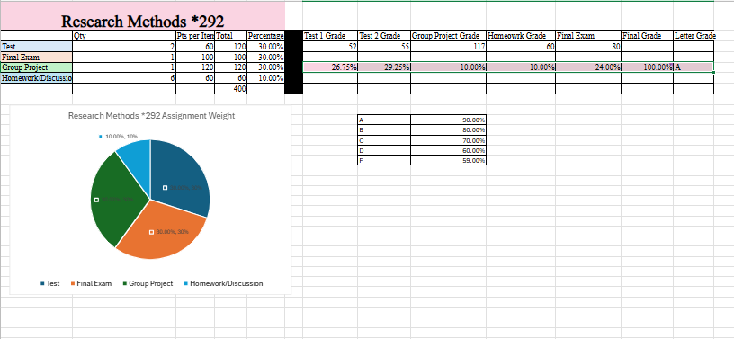

# Silvia Gonzalez-Mendez

# Lawyer

# Contact Information
- Email: Silviaraquelg459@gmail.com
- Cell Phone: 240-626-5504

# About Me
Hello! I am an experienced Lawyer and immigration and corporate professional with over 8 years of proven expertise in immigration law and corporate compliance. With skills in legal research and analysis, contract negotiation, regulatory compliance, and client advocacy, I am able to develop strategic legal solutions, and achieve successful outcomes for diverse clients. I am adept at using Visual Studio Code, Git/GitHub, and Linux/Unix-based systems.

My versatile skill set, commitment to equal justice, and passion for empowering individuals and businesses makes me a valuable asset to any team or organization. In my spare time, I enjoy volunteering with immigrant support organizations and staying informed about the business marketplace.

## Connect with me

### Education
## Bachelor of Arts in Psychology and Political Science ###
> *Loyola University Maryland, Baltimore, MD*

***
### Projects

#### Excel Side Business
 - Project 1 Summary 

 - 
 - I was assigned to create a project based on any item I would want to market, and to calculate how much profit I could potentially make from selling it. The goal was to determine whether the item would be a worthwhile investment. I chose to focus on luxury handbags, and through the project, I was able to track monthly loan payments and estimate potential profits to see if the business idea would be financially sustainable.
- To complete this project, I used Excel to create spreadsheets that tracked costs, loan payments, and monthly profits.
- A challenge I faced was accurately calculating monthly loan payments and predicting realistic profit margins. It was difficult at first to balance production costs, loan repayments, and expected revenue.
- My goal was to understand whether selling luxury handbags could be a profitable and sustainable business idea. I achieved this by building a complete financial model and determining that the project could potentially be profitable depending how much percentage I were to take from the original cost. If I were to take this project further, I would like to improve by doing more detailed market research, such as understanding what my target market wants and exploring different types of trending handbags to better meet market demand.
- Tthis project helped me understand the financial planning needed to start a side business. By calculating profits and analyzing costs, I learned how important it is to carefully manage expenses and pricing.

***
#### Course Grade Calculator
 - Project 2 Summary

 - 
 - I was assigned to create a Grade Calculator that helped me keep track of my college course grades and project the final GPA based on assignment scores. This has greatly helped me stay organized, set academic goals, and prioritize my efforts in my courses.
- I used Excel to create the Grade Calculator and built formulas for automatic grade calculations, used conditional formatting for letter grades, and created an annotated pie chart to show the weight of each assignment type.
- One challenge I faced was setting up correct formulas to automatically calculate final grades and assign letter grades. At first, my conditional statements were incorrect, but I overcame this by reviewing examples online and double-checking my formulas with other peers input.
- I set out to create a functional Grade Calculator that would simplify tracking and projecting final grades. I achieved my goal, but if I could take it further, I would add a feature that highlights grades in red when they begin to slip, based on the thresholds I personally set for what I consider a low grade.
- In summary, I created an Excel Grade Calculator featuring auto-formulas, conditional formatting, and pie charts, and I successfully overcame formula errors along the way.

***
#### Budget Tracker
 - Project 3 Summary 

 - 
 - I was assigned to make a budget planner to track my expenses, including biweekly or monthly income, current savings, savings goals, and spending habits such as shopping, entertainment, dining out, and car maintenance. As a college student, there are many temptations to overspend, so the best way to stay organized is to plan ahead and get notified when going over budget.
 - I used Microsoft Excel to create my budget planner.
 - A challenge I faced was learning how to correctly allocate money into different categories and how to prioritize saving. I overcame this by creating formulas that accurately tracked my spending and savings, ensuring that I stayed within my budget while correctly distributing my funds.
 - I set out to achieve a complete yearly budget tracker, and I was successful in tracking all my expenses per month and per the year. I was also able to calculate my monthly and annual income and leave room for personal spending. If I could take it further, I would add automatic alerts for when spending in a category is too high and possibly include graphs for better visual tracking.
 - In summary, I created a yearly budget tracker to manage income, savings, and expenses. This project helped me prioritize my financial goals and develop better saving habits as a college student.

